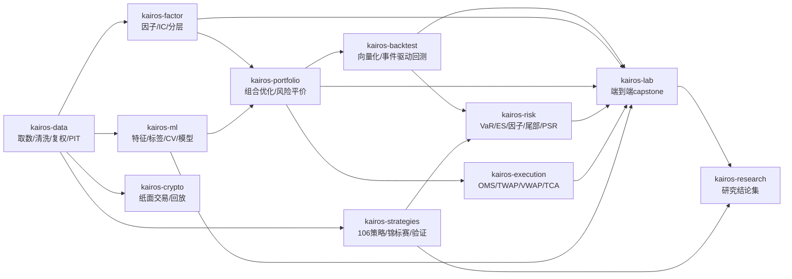

# Kairos 量化系列 (Kairos Quant Suite)

> 一套**自研、原创**的量化金融项目集合。所有代码独立编写（MIT 许可），仅依赖 numpy/pandas 等基础库，离线可复现、含完整测试，并已接入**真实 A 股/ETF 数据**（后复权 hfq）。

**11 个项目 · 1620 个测试用例 · 6 层分类 · 全部带 GitHub Actions CI**

## 分类目录

### 基础设施 · Foundation

| 项目 | 说明 | 测试 |
|---|---|---|
| [kairos-data](https://github.com/Bruce848647703/kairos-data) · **数据管道 / 行情** | 自研金融数据管道：复权、日历对齐、时点正确性(PIT)、本地存储与清洗；含 A 股个股(38只)与跨资产ETF(14只/6类别)真实行情适配器(腾讯/新浪,后复权hfq)与已提交真实数据集。 | 75 ✅ |
| [kairos-backtest](https://github.com/Bruce848647703/kairos-backtest) · **回测框架** | 自研轻量回测框架：向量化 + 事件驱动，防未来函数，含绩效分析与成本模型；含真实 A 股回测示例。 | 27 ✅ |
| [kairos-execution](https://github.com/Bruce848647703/kairos-execution) · **交易执行 / OMS** | 自研交易执行：OMS 状态机、TWAP/VWAP/Iceberg/IS 算法、延迟·部分成交模拟、TCA；含真实 A 股 bar 执行 TCA 示例。 | 81 ✅ |

### 研究 · Research

| 项目 | 说明 | 测试 |
|---|---|---|
| [kairos-factor](https://github.com/Bruce848647703/kairos-factor) · **因子 / Alpha 研究** | 自研因子研究库：IC/RankIC/IR、分层回测、去极值·标准化·中性化、IC 衰减；含真实 A 股因子研究示例。 | 67 ✅ |
| [kairos-portfolio](https://github.com/Bruce848647703/kairos-portfolio) · **组合优化 / 风险** | 自研组合优化与风险：均值-方差、风险平价、Ledoit-Wolf 收缩、VaR/CVaR、有效前沿；含真实 ETF 组合优化示例。 | 71 ✅ |
| [kairos-ml](https://github.com/Bruce848647703/kairos-ml) · **机器学习** | 自研金融机器学习：三重障碍、purged/embargo CV、walk-forward、numpy 自研模型（不依赖 sklearn）；含真实 A 股 ML 信号研究示例。 | 85 ✅ |
| [kairos-risk](https://github.com/Bruce848647703/kairos-risk) · **风险分析** | 自研风险分析库：VaR/ES、成分风险分解、因子风险模型、回撤、压力测试、EVT 尾部、PSR/DSR；含真实 A 股组合风险报告示例。 | 267 ✅ |

### 策略 · Strategies

| 项目 | 说明 | 测试 |
|---|---|---|
| [kairos-strategies](https://github.com/Bruce848647703/kairos-strategies) · **策略研究库** | 多渠道收集策略、原创实现、向量化回测，固化「策略→回测→样本外验证→锦标赛优选→结果」完整 QR 流程（106 策略 / 27 渠道 + 多资产配置），支持合成、真实 A 股、行业均衡、真实多资产 ETF 回测。 | 764 ✅ |

### 市场应用 · Markets

| 项目 | 说明 | 测试 |
|---|---|---|
| [kairos-crypto](https://github.com/Bruce848647703/kairos-crypto) · **加密货币量化** | 自研加密货币纸面交易框架：交易所无关抽象、纸面撮合、动量/网格/定投策略（纯模拟，无真实下单）；支持任意历史 OHLCV 回放。 | 142 ✅ |

### 端到端集成 · Lab

| 项目 | 说明 | 测试 |
|---|---|---|
| [kairos-lab](https://github.com/Bruce848647703/kairos-lab) · **端到端研究流水线 (Capstone)** | Capstone：用真实 A 股/ETF 数据把 data→factor→portfolio→backtest→risk→execution→ml 七个自研包串成端到端流水线（个股因子组合 / 多资产风险平价 / 执行 TCA）。 | 28 ✅ |

### 研究结论 · Insights

| 项目 | 说明 | 测试 |
|---|---|---|
| [kairos-research](https://github.com/Bruce848647703/kairos-research) · **研究结论集** | 跨仓库真实数据实验的综合研究结论：异象图谱 / ML vs 单因子 / 多资产 / 锦标赛 / 风险尾部 / 执行 TCA / 数据方法论；11 篇笔记 + 126 条可溯源发现。 | 13 ✅ |

## 各层职责
- **基础设施 Foundation**：数据接入与清洗、回测引擎、交易执行/OMS —— 支撑上层研究的底座。
- **研究 Research**：因子/Alpha、组合优化与风险、机器学习 —— 从数据到信号再到组合的研究工具。
- **策略 Strategies**：多渠道收集策略、原创实现、回测并固化完整 QR 研究记录。
- **市场应用 Markets**：面向具体市场（加密货币）的端到端应用框架。
- **端到端集成 Lab**：capstone 流水线，用真实数据把上述各包串成完整研究工作流。
- **研究结论 Insights**：跨仓库真实数据实验的综合研究报告（结论均可溯源）。

## 架构与工作流



## 真实数据研究亮点（hfq A股/ETF，均诚实呈现，非投资建议）

- **多资产最稳健**：14 只跨资产 ETF 上，全天候 `all_weather` 夏普 **1.52**、最大回撤仅 **5.1%**；风险平价 `risk_parity` 夏普 1.39；均显著优于等权基准（夏普 0.59、回撤 17%）。
- **策略组合优于单策略**：106 策略锦标赛去相关精选出的精英组合夏普 **0.93**、回撤 **15.2%**，相比等权基准（0.76 / 31.2%）回撤近乎减半。
- **单因子 alpha 稀薄**：38 只 A 股池中，16 个（因子×预处理×样本）组合按非重叠口径 **无一** |t|≥2；唯一稳健信号是低波动异象（裸因子 rv10 样本外 IC t≈**-5.0**）。
- **ML 未跑赢单因子**：Ridge/Logistic/GBM 在严格 walk-forward/purged 样本外 **无正向预测力**，反而稀释了低波信号——诚实负结果。
- **风险画像**：真实组合 94.6% 方差来自单一市场因子；尾部显著肥于正态（Hill ξ≈**0.45**，99.9% POT VaR 约为正态法 1.7 倍）；考虑选组合的多重检验后 DSR 从 PSR 0.98 降至 ~0.34。
- **数据完整性教训**：腾讯前复权(qfq)对高分红股产生**负价/假收益**（单日 >2000%），已全链切换**后复权(hfq)** 并重生成所有真实结果（等权基准收益由虚高 +1170% 修正为真实 +145%）。

详见 [kairos-research](https://github.com/Bruce848647703/kairos-research)（11 篇结论笔记 + 126 条可溯源发现）。

## 复现
```bash
# 任一仓库：
git clone https://github.com/Bruce848647703/kairos-strategies && cd kairos-strategies
pip install -e '.[dev,plot]'
python -m pytest -q                 # 跑测试
python examples/run_all.py          # 合成数据回测(离线)
python examples/run_real.py         # 真实A股回测(首次联网抓取hfq数据)
```

## 设计与合规
- 每个仓库均为独立可安装 Python 包（`kairos_*`），统一结构：包 + `examples/` + `tests/` + `pyproject.toml` + `Makefile`。
- **100% 原创**：借鉴公开的通用量化范式与算法思想，但代码、接口、文档均自研，未复制任何第三方项目。
- 全部 MIT 许可，版权归原作者；仅用于学习与研究，**不构成任何投资建议**。

## 许可
MIT © 2026 Bruce848647703。
